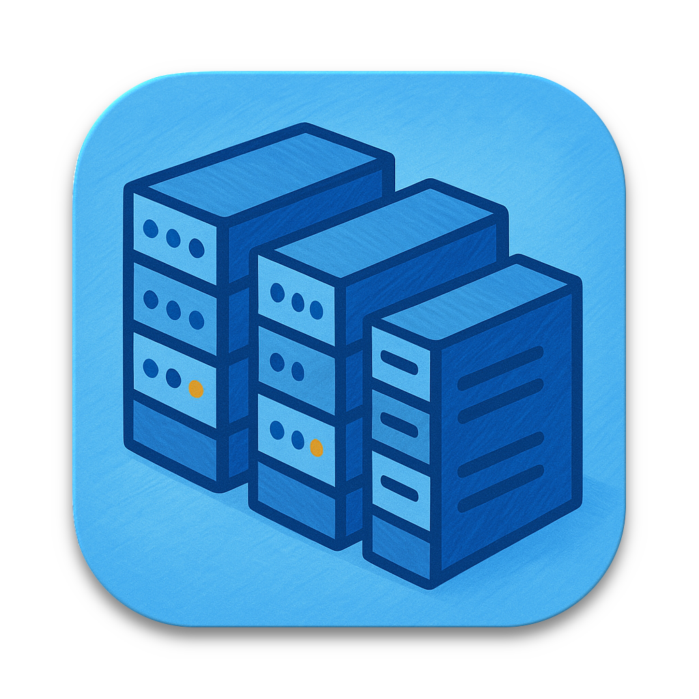

# Documentation Synchronization System

This document explains how the automatic documentation synchronization works between the wiki and GitHub Pages at **https://caker.aldunelabs.com**.

## 🏗 Architecture

```
wiki/                     →    docs/                    →    GitHub Pages
├── Home.md               →    ├── index.md             →    https://caker.aldunelabs.com
├── Getting-Started.md    →    ├── getting-started.md   →    /getting-started
├── Architecture.md       →    ├── architecture.md      →    /architecture
├── Development.md        →    ├── development.md       →    /development
├── Command-Summary.md    →    ├── command-summary.md   →    /command-summary
├── Troubleshooting.md    →    ├── troubleshooting.md   →    /troubleshooting
├── FAQ.md                →    ├── faq.md               →    /faq
├── Release-Notes.md      →    ├── release-notes.md     →    /release-notes
└── Cheat-Sheet.md        →    └── cheat-sheet.md       →    /cheat-sheet
```

## 🔄 How It Works

### Automatic Synchronization (Recommended)

1. **Source of Truth**: Edit files in `wiki/` directory
2. **GitHub Action Trigger**: When you push changes to `main` branch with wiki modifications
3. **Automatic Processing**:
   ```
   📝 Detect wiki changes
   ↓
   🔄 Convert wiki format → GitHub Pages format
   ↓  
   ➕ Add Jekyll frontmatter and navigation
   ↓
   🔗 Convert internal links (wiki-style → docs-style)
   ↓
   🖼️ Update image references
   ↓
   💾 Commit & push changes to docs/
   ↓ 
   🚀 Deploy to GitHub Pages (caker.aldunelabs.com)
   ```

### Manual Synchronization

For immediate updates or when automatic sync fails:

```bash
# Quick sync (recommended)
./Scripts/quick-sync-docs.sh

# Full sync with detailed output
./Scripts/sync-docs-from-wiki.sh

# Review and commit
git add docs/ && git commit -m "docs: sync from wiki" && git push
```

## 📂 File Mapping

| Wiki File | Docs File | GitHub Pages URL | Navigation Order |
|-----------|-----------|------------------|------------------|
| `Home.md` | `index.md` | `/` (home) | 1 |
| `Getting-Started.md` | `getting-started.md` | `/getting-started` | 2 |
| `Architecture.md` | `architecture.md` | `/architecture` | 3 |
| `Development.md` | `development.md` | `/development` | 4 |
| `Command-Summary.md` | `command-summary.md` | `/command-summary` | 5 |
| `Troubleshooting.md` | `troubleshooting.md` | `/troubleshooting` | 6 |
| `FAQ.md` | `faq.md` | `/faq` | 7 |
| `Release-Notes.md` | `release-notes.md` | `/release-notes` | 8 |
| `Cheat-Sheet.md` | `cheat-sheet.md` | `/cheat-sheet` | 9 |

## 🔧 Content Transformations

The sync process automatically handles:

### 1. Jekyll Frontmatter Addition
```markdown
# Before (wiki)
# Getting Started

# After (docs)
---
layout: default
title: Getting Started
nav_order: 2
---

# Getting Started
```

### 2. Link Conversion
```markdown
# Before (wiki)
[Getting Started](Getting-Started)
[Architecture](Architecture)

# After (docs)  
[Getting Started](getting-started)
[Architecture](architecture)
```

### 3. Image Reference Updates
```markdown
# Before (wiki)


# After (docs)

```

### 4. Home Page Special Handling
The `wiki/Home.md` becomes `docs/index.md` with additional metadata:
- GitHub badges (including documentation badge pointing to caker.aldunelabs.com)
- Enhanced layout (`layout: home`)
- Featured content sections

## 🌐 Custom Domain Configuration

The GitHub Pages site is configured to use the custom domain **caker.aldunelabs.com**:

### DNS Configuration
- Domain must point to GitHub Pages IP addresses
- CNAME record: `caker.aldunelabs.com` → `fred78290.github.io`

### Jekyll Configuration
```yaml
# docs/_config.yml
url: https://caker.aldunelabs.com
baseurl: ""
```

### GitHub Pages Settings
- CNAME file contains: `caker.aldunelabs.com`
- Repository Pages settings configured for custom domain
- HTTPS enforced automatically

## 🚨 GitHub Action Details

**Trigger**: `.github/workflows/sync-docs-from-wiki.yaml`

**When it runs**:
- Push to `main` with changes to `wiki/**`
- Manual dispatch via GitHub Actions UI

**What it does**:
1. ✅ Check for wiki file changes
2. 🔄 Run synchronization script
3. 📝 Commit any docs updates (with `[skip ci]`)
4. 🚀 Deploy to GitHub Pages at caker.aldunelabs.com

**Permissions needed**:
- `contents: write` (commit to repository)
- `pages: write` (deploy to GitHub Pages)
- `id-token: write` (GitHub Pages authentication)

## 📚 Best Practices

### ✅ Do
- **Edit wiki files as the source of truth**
- **Use relative links in wiki** (they'll be converted automatically)
- **Include images in appropriate directories** (`Resources/` for source)
- **Test with manual sync before pushing** if making major changes

### ❌ Don't  
- **DON'T edit `docs/*.md` files directly** (they'll be overwritten)
- **DON'T edit Jekyll configuration** without updating scripts
- **DON'T break wiki link formatting** (conversion depends on it)

## 🔍 Troubleshooting

### Sync Not Working
1. Check GitHub Action logs in repository Actions tab
2. Verify wiki files have changes compared to last commit
3. Run manual sync to test locally: `./Scripts/quick-sync-docs.sh`

### Preview Changes Locally
```bash
cd docs
bundle install
bundle exec jekyll serve
# Visit http://localhost:4000
```

### Custom Domain Issues
1. Verify DNS configuration points to GitHub Pages
2. Check CNAME file contains correct domain (`caker.aldunelabs.com`)
3. Ensure GitHub Pages settings are configured correctly
4. Allow time for DNS propagation (up to 24 hours)

### Force Sync
```bash
# Via GitHub Actions UI
# Go to Actions → "Sync Docs from Wiki" → "Run workflow" → Check "Force sync"

# Or manually
./Scripts/sync-docs-from-wiki.sh
git add docs/ && git commit -m "docs: sync from wiki" && git push
```

## 🔗 Related Files

- **Scripts**:
  - [`Scripts/sync-docs-from-wiki.sh`](Scripts/sync-docs-from-wiki.sh) - Main sync logic
  - [`Scripts/quick-sync-docs.sh`](Scripts/quick-sync-docs.sh) - Convenience wrapper
  - [`Scripts/publish-wiki.sh`](Scripts/publish-wiki.sh) - Publishes to GitHub Wiki

- **GitHub Actions**:
  - [`.github/workflows/sync-docs-from-wiki.yaml`](.github/workflows/sync-docs-from-wiki.yaml) - Auto sync
  - [`.github/workflows/publish-wiki.yaml`](.github/workflows/publish-wiki.yaml) - Wiki publishing

- **Configuration**:
  - [`docs/_config.yml`](docs/_config.yml) - Jekyll configuration
  - [`docs/CNAME`](docs/CNAME) - Custom domain configuration
  - [`docs/README.md`](docs/README.md) - GitHub Pages documentation

## 📊 Site Experience

The site at **https://caker.aldunelabs.com** provides:
- Professional documentation experience with custom domain
- Search functionality and mobile-responsive design
- Fast loading with Jekyll static generation
- SEO-optimized content with custom meta tags
- SSL certificate automatically provided by GitHub Pages
- Branded URL for better user experience