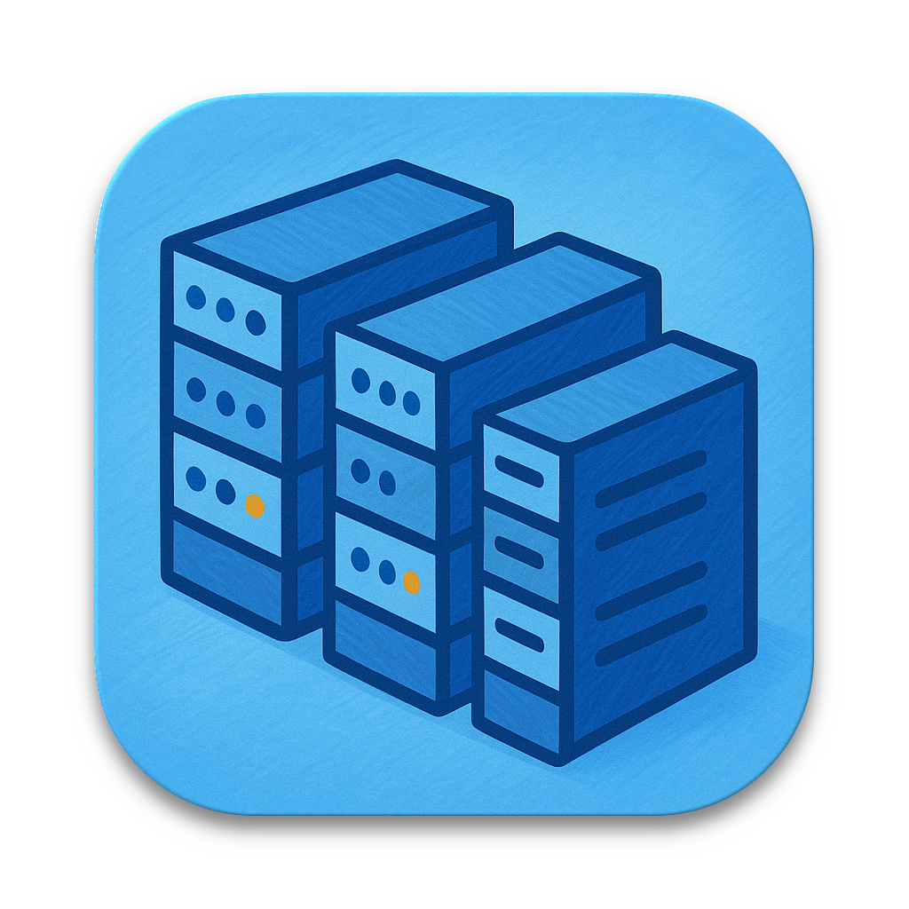
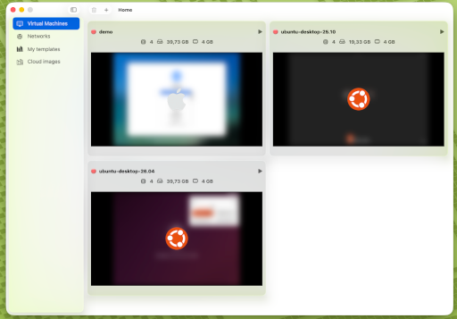
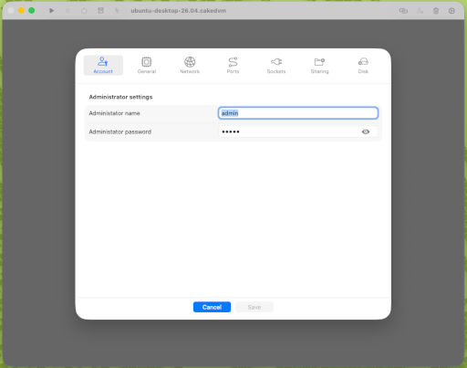
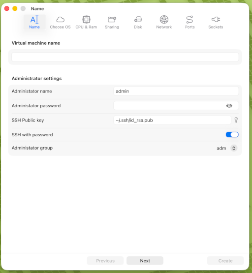

	
	
	

<h1 align="center">Caker</h1>

	

Caker is a Swift-based tool for building and managing virtual machines with the Virtualization framework, focused on simplicity and developer experience.

Available features include:
- Port forwarding between the VM and the host using TCP or Unix sockets
- Dynamic port forwarding updates while virtual machines are running
- Network creation in bridge, hosted, or NAT mode
- Cloud-Init support for VM initialization and customization
- Automatic installation of an in-guest agent, with source code in [cakeagent](https://github.com/Fred78290/cakeagent)

## Wiki

- Local wiki home: [wiki/Home.md](wiki/Home.md)

## Caked command line

`caked` is the core daemon process that handles virtual machine lifecycle management, including building, running, and orchestrating virtual machines with configuration-driven workflows.

## Cakectl command line

`cakectl` is the command-line interface tool used to interact with `caked`. It provides commands to:
- Build and deploy applications
- Manage virtual machine configurations
- View logs and status
- Control the daemon process

## Caker.app

`Caker.app` is the macOS desktop application that provides a graphical experience for working with virtual machines managed by `caked`.
It acts as the user-facing control plane of the project and is designed for day-to-day local development workflows.

	

		
		
		
	

Its main role is to:
- Create and configure virtual machines from macOS
- Start, stop, and monitor virtual machine instances
- Embed and run standalone virtual machines directly in `Caker.app`
- Offer a VNC frontend to view virtual machine displays
- Expose logs, status, and diagnostics in an accessible UI
- Integrate with the local daemon and CLI tooling without requiring manual low-level setup

## Caked Service

`caked` can run as a `launchd` background service on macOS to run virtual machine workloads. It handles the core execution and management of virtual machines, including:

- **Virtual Machine Lifecycle Management**: Starting, stopping, and monitoring running virtual machines
- **Resource Allocation**: Managing CPU, memory, and storage resources for virtual machines
- **Service Registration**: Registering virtual machines as system services for persistent operation
- **Health Monitoring**: Continuously checking virtual machine health status and auto-recovery
- **Logging and Diagnostics**: Collecting and streaming virtual machine logs and diagnostic information

Working in conjunction with `cakectl`, the command-line control interface, `caked` provides the backend daemon that executes administrative commands and maintains the operational state of all managed virtual machines.
Together, `caked` and `cakectl` form a powerful system for virtual machine development and deployment.

## Security

Please report vulnerabilities responsibly using the project's security policy:

- [SECURITY.md](SECURITY.md)

## Contributing

Contributions are welcome! Please feel free to submit a pull request or open an issue to report bugs or suggest enhancements.

- Contributor guide: [CONTRIBUTING.md](CONTRIBUTING.md)
- CI workflow policy (no PR-triggered actions): [CONTRIBUTING.md#ci-workflow-policy](CONTRIBUTING.md#ci-workflow-policy)